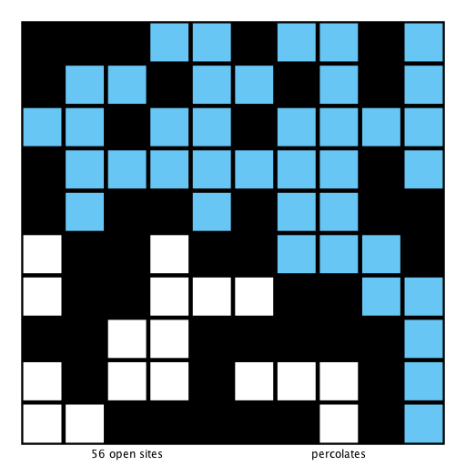

Percolation Assignment
======================

In a famous scientific problem, researchers are interested in the following question: if sites are independently
set to be open with probability p (and therefore blocked with probability 1 − p), what is the probability that
the system percolates? When p equals 0, the system does not percolate; when p equals 1, the system percolates.

Using Monte Carlo simulations, estimate the percolation threshold.

Specifications
--------------
https://coursera.cs.princeton.edu/algs4/assignments/percolation/specification.php

Visuals
-------

